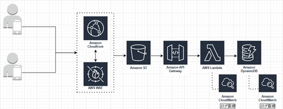
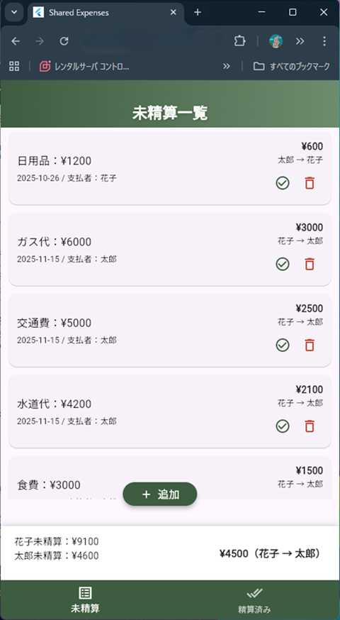
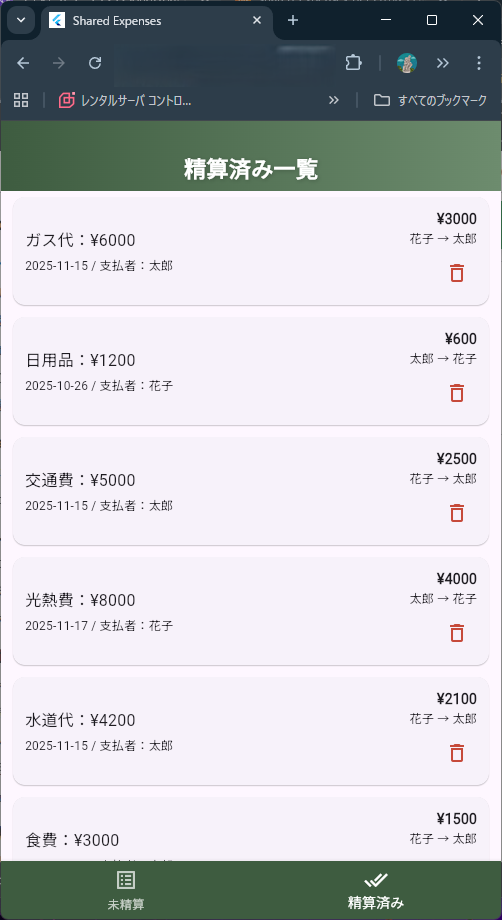
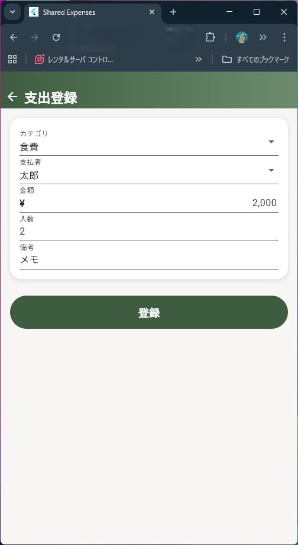

# アーキテクチャ概要（Shared Expense App）

## 1. CloudFront へのアクセスと WAF 制御

1. 利用者が CloudFront の URL にアクセスする  
2. WAF がアクセス元 IP を確認し、許可/拒否を判定する  
   - **許可 ⇒** 次の処理へ進む  
   - **拒否 ⇒** CloudFront の *Error Response* 設定により **sorry ページ** を返す

---

## 2. CloudFront → S3 のフロントエンド配信

- CloudFront はオリジンとして設定された **S3 バケット** にアクセスする
- デフォルトルートオブジェクト設定（`index.html`）に従い  
  Flutter Web でビルドされた UI（`main.dart.js` 等）が返される

---

## 3. API Gateway → Lambda → DynamoDB のバックエンド処理

Flutter Web の画面から API を呼び出すと、API Gateway が受け取り  
パスごとに適切な Lambda にルーティングされる

###  API 一覧と対応 Lambda

| HTTP Method | Path              | Lambda 名                     | 処理内容 |
|-------------|-------------------|-------------------------------|----------|
| POST        | /expenses         | shared-expenses-create        | DynamoDB に新規データを保存 |
| GET         | /expenses         | shared-expenses-get           | DynamoDB からデータ一覧を取得し返却 |
| DELETE      | /expenses/{id}    | shared-expenses-delete        | 指定 ID のデータを削除 |
| PUT         | /expenses/{id}    | shared-expenses-update        | 指定 ID の `settled` を true に更新 |

---

## 4. DynamoDB テーブル構成

| カラム名   | 説明             | 型      |
|------------|------------------|---------|
| id         | 一意の ID（PK）   | String |
| amount     | 金額             | Number |
| category   | 項目名           | String |
| date       | 日付（YYYY-MM-DD）| String |
| members    | 人数             | Number |
| note       | 備考             | String |
| payer      | 支払者名         | String |
| settled    | 精算済みフラグ   | Boolean |

---

## 全体構成図

## レイアウト
### 未精算一覧画面

### 精算済み一覧画面

### 支出登録画面

